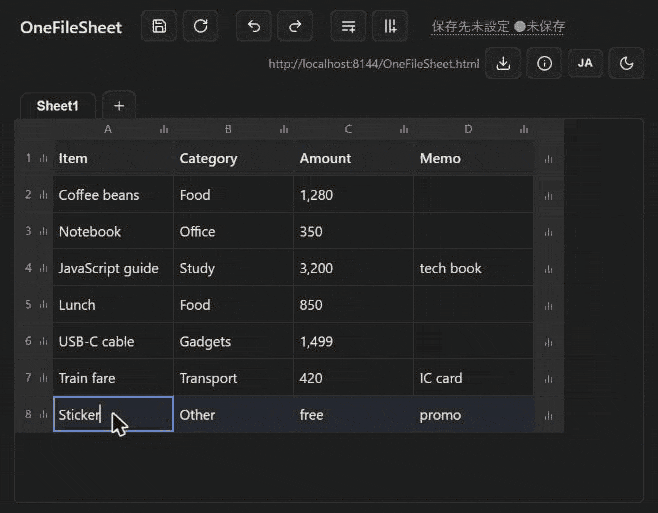

# One File Sheet

A self-saving spreadsheet in a single HTML file. The app and the data live in the same file, so AI agents can read and write it directly, and sharing means sending one file.

[日本語](README.md) | English



**[▶ Open the demo](https://firemio.github.io/OneFileSheet/OneFileSheet.html)** / **[⬇ Download](https://github.com/firemio/OneFileSheet/releases/latest)** — just open `OneFileSheet.html` in a browser.

## Why

Tables in xls or the cloud are awkward for AI agents to read and impossible to diff. So the app and its data became one JSON-carrying HTML file.

## Features

- **Single file, ~24KB** — no server, no install, no `localStorage`. Data is JSON inside the HTML
- **Self-saving** — Chrome / Edge write back into the file itself (Ctrl+S); other browsers fall back to downloading the HTML
- **Spreadsheet basics** — multiple sheets, range paste from Excel / Google Sheets, row/column insert & delete, undo / redo, Alt+Enter for in-cell line breaks
- **Quick stats** — header chart icons show count / sum / average / max / min; nothing is written to cells
- **Fast with thousands of rows** — virtualized rendering, pinned headers
- **47 themes + EN/JA UI** — saved inside the file, so it looks the same everywhere
- **AI-agent friendly** — pretty-printed JSON, an editing contract (AGENT NOTES) ships in the file, external edits are detected at save time

## Good fits

| Use it for | Why it works |
|---|---|
| A shared sheet with AI agents | "Write your findings into this table", "work through these TODOs" — humans use the browser, agents read/write the JSON |
| An output template for LLMs | Hand an empty sheet over with "answer in this format" — the returned JSON opens as a table |
| A dashboard you can hand out | A cron job / CI rewrites the sheet-data block: open = up to date. Put it on Pages for a zero-server public dashboard |
| Git as a time-series DB | CI appends benchmark or coverage history; git keeps the history, diffs and rollbacks |
| Tracking tables in a repo | Endpoint inventories, test cases, checklists — reviewed in PRs |
| Send out, fill in, collect | Recipients just open it in a browser — no Excel |
| Handing a table to non-technical people | .md is raw text to them, CSV mangles encodings, Excel may not be installed — but anyone can open it as a table in a browser and make a small edit |
| Offline / restricted sites | Runs on nothing but a browser; travels on a USB stick |
| Household / expense notes | Quick stats show sums and averages at a glance |

Not for: confidential data (plain text), formula-driven work, tens of thousands of rows.

## Usage

1. Open `OneFileSheet.html` in a browser and edit
2. Ctrl+S to save. Only the first save asks you to pick the file itself (one click after that)
3. To open another file, open it directly or drag & drop it onto the page

## Data format

The only data is the JSON inside `<script id="sheet-data">` — the edited HTML is the data file.

```html
<script id="sheet-data" type="application/json">
{ "title": "...", "theme": "auto", "lang": "auto", "activeSheet": 0,
  "sheets": [ { "name": "Sheet1", "data": [["Header1", "Header2"], ["value", "value"]] } ] }
</script>
```

Just handing the file to an AI agent works (AGENT NOTES ship inside). To be explicit, attach this:

```text
This OneFileSheet.html is a self-contained single-file spreadsheet. It is about
24KB, but most of it is the compressed app runtime - ignore that part.
The actual data is ONLY the JSON inside the
<script id="sheet-data" type="application/json"> block.

Format: { "title", "theme", "lang", "activeSheet", "sheets": [ { "name", "data" } ] }
- Each sheet's data is a 2D array of strings; data[0] is the header row (all rows equal length)
- Edit only that JSON. Keep the opening tag unchanged and keep the
  JSON.stringify(doc, null, 2) formatting
- Write "<" in cell values as \u003c
```

## Development

Readable source: [src/OneFileSheet.html](src/OneFileSheet.html). Run `npm install` once (build-only), then `node build.js` to produce the minified, packed distribution. The app itself has zero runtime dependencies.

[MIT License](LICENSE)
