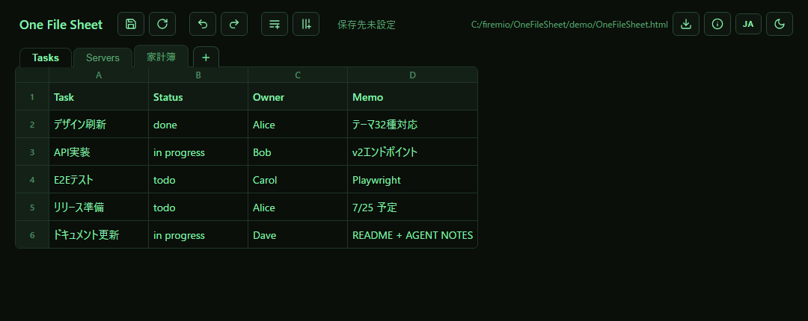

# One File Sheet

1つのHTMLファイルだけで動く、自己保存型のスプレッドシートです。

日本語 | [English](README.en.md)



**[▶ ブラウザでデモを開く](https://firemio.github.io/OneFileSheet/OneFileSheet.html)** — そのまま編集・貼り付け・アンドゥを試せます。編集内容はダウンロードボタンの「HTML をエクスポート」で、アプリ＋データ入りのファイルとして保存できます。

**[⬇ ダウンロード（最新リリース）](https://github.com/firemio/OneFileSheet/releases/latest)** — 添付の `OneFileSheet.html` を1つ入手してブラウザで開くだけで使えます。

## なぜ作ったか

ちょっとした表データが xls や Google スプレッドシートに入っていると、AI エージェントに中身を探させたり、編集内容の diff を取ったりするのが面倒です。

One File Sheet は、表計算アプリとデータを1つのHTMLファイルにまとめます。アプリ本体とデータが同じファイルにあるため、AI エージェントから読み書きしやすく、共有も配布も1ファイルで済みます。

## 特徴

- **1ファイル完結** — サーバー・インストール・`localStorage` 不使用。データはHTML内のJSON。配布ファイルは自己解凍圧縮で約31KB
- **自己保存** — Chrome / Edge ならファイル自身に上書き保存(File System Access API)。初回保存時にファイルを選ぶだけ(前回のフォルダから開きます)。ファイルをページにドラッグ&ドロップして開くことも可能
- **非対応ブラウザでも使える** — スマートフォン各ブラウザや Firefox / Safari では「上書き保存」が自動的にHTMLダウンロードに切り替わります
- **複数シート** — タブで切替。追加・名前変更(ダブルクリック)・並べ替え・削除
- **表計算らしい編集** — Enter / Tab / 矢印キーでセル移動、Excel / Google スプレッドシートからの範囲貼り付け(改行入りセル対応)、行/列の挿入・削除、Ctrl+Z / Ctrl+Y、Ctrl+S、Alt+Enter でセル内改行
- **クイック統計** — 各行・各列の両端のグラフアイコンにホバーで合計・平均・件数・最大・最小を表示。クリックで固定でき、編集にライブ追従。セルには何も書き込まない読み取り専用ビュー
- **エクスポート** — HTML(アプリ＋全シート入りの自分自身の複製)と CSV(BOM付きUTF-8、Excelで文字化けしない)
- **テーマ43種 + 自動**(Neon / Cyberpunk / Synthwave の発光系、Pop Cyan / Pop Red などの原色ポップ系8種入り) / **UI言語 日本語・英語**(既定はブラウザ言語に追従) — 選択はファイルに保存され、共有先でも同じ見た目
- **AIエージェント親和** — データは整形済みJSON。編集規約(AGENT NOTES)をファイル内に同梱し、外部編集との競合は保存時に検知して警告

## こんな用途に

- **AIエージェントの作業台帳(原点)** — 「調査結果をこの表に書いて」「この表のTODOを処理して」とエージェントに渡す。JSONなので直接読み書きでき、`git diff` で変更が追える
- **リポジトリ同梱の管理表** — APIエンドポイント台帳、環境変数一覧、テストケース表、リリースチェックリストなどをコードと一緒に版管理し、PRでdiffレビューする
- **配って・記入してもらって・回収する調査票** — メールやチャットで配布し、相手はブラウザで開いて記入、エクスポートして返送。Excel不要・インストール不要
- **オフライン・制限環境の帳票** — クラウド不可・ソフトインストール不可の現場でも、ブラウザさえあれば動く。USBメモリで持ち運べる
- **家計簿・経費メモ** — クイック統計で合計・平均が即見える。月ごとにファイルを複製する連番運用と相性がよい
- **ビューア込みのデータ受け渡し** — CSVと違って文字化けや列崩れがなく、テーマ込みで相手の環境でも同じ見た目で開く

向かない用途: 機密情報の管理(平文保存)、数式が本体の計算業務(数式は非搭載。集計はクイック統計かAIエージェントに)、数万行規模の大規模データ。

## 使い方

1. [リリースページ](https://github.com/firemio/OneFileSheet/releases/latest)から `OneFileSheet.html` をダウンロードし、ブラウザで開きます。
2. 表を編集します。
3. 「上書き保存」または Ctrl+S を押します。Chrome / Edge では初回だけファイル選択ダイアログが開くので、`OneFileSheet.html` 自身を選ぶとそのまま保存されます。2回目以降はワンクリックです。
4. 非対応ブラウザでは、保存が自動的にHTMLダウンロードになります。

別の One File Sheet ファイルを編集したい場合は、そのファイル自体をブラウザで開くか、開いているページにドラッグ&ドロップします(アプリはファイルに同梱されています)。

保存先はブラウザの IndexedDB にファイルURLごとに記録され、次回以降は自動で復元されます。ブラウザが再許可を求めた場合は、画面の許可操作に従ってください。

## データ形式

表データは、HTML内の次の要素に JSON として保存されます。編集後の `OneFileSheet.html` 自体がデータファイルでもあります。

```html
<script id="sheet-data" type="application/json">
{
  "title": "OneFileSheet",
  "theme": "auto",
  "lang": "auto",
  "activeSheet": 0,
  "sheets": [
    { "name": "Sheet1", "data": [["見出し1", "見出し2"], ["値", "値"]] }
  ]
}
</script>
```

各シートの `data` は「文字列の2次元配列」で、先頭行が見出し行です。旧形式(2次元配列のみ)のファイルも読み込み時に自動移行されます。保存時にはセル内の `<` をJSONのユニコードエスケープに変換して書き込むため、セルにHTMLタグや `$` 記号などを入力してもファイルが壊れることはありません。

AI エージェント向けの編集規約は、HTML内の sheet-data ブロック直前にある `AGENT NOTES` コメントに記載しています。

## 注意

- ファイル自身への上書き保存は File System Access API(Chrome / Edge)を使います。ブラウザの仕様上、初回保存時にユーザーがファイルを選択して許可を与える必要があります。
- データは平文で保存されます。パスワードなどの機密情報の管理には使わないでください。

## 開発

可読なソースは [src/OneFileSheet.html](src/OneFileSheet.html) にあります。`node build.js`(依存パッケージ・ネットワーク不要)を実行すると、CSS・マークアップ・アプリJSを deflate 圧縮した自己解凍形式の配布用 `OneFileSheet.html` が生成されます。sheet-data の JSON と AGENT NOTES は圧縮後も平文のまま残るため、AIエージェントによるデータの読み書きはどちらのファイルでも同じように行えます。

## ライセンス

MIT License のオープンソースソフトウェアです。利用、改変、再配布、商用利用ができます。詳しくは [LICENSE](LICENSE) を参照してください。
